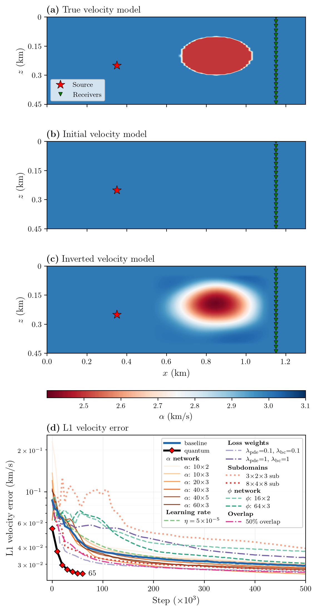

# quFWI — Hybrid Quantum Full Waveform Inversion

Hybrid quantum-classical Full Waveform Inversion (FWI) using FBPINNs (Finite Basis Physics-Informed Neural Networks) with JAX.

## Overview

This repository implements the acoustic FWI problem using both:
- **Classical FBPINNs** (`scripts/fwi_classical.py`) — fully connected networks
- **Quantum-hybrid FBPINNs** (`scripts/fwi_quantum.py`) — classical layers + variational quantum circuit (PQC)

The quantum circuit implementation (`src/qufwi/pqcs/`) is a standalone JAX module with no fbpinns dependency, enabling future comparison work (e.g., PennyLane).

## Installation

```bash
uv sync
```

This installs all dependencies including JAX with CUDA 12 GPU support. To run scripts:

```bash
uv run python scripts/rasht/fwi_classical.py
```

## Usage

```bash
# Classical FWI
uv run python scripts/rasht/fwi_classical.py

# Quantum-hybrid FWI (set XLA flag to reduce memory overhead)
XLA_FLAGS=--xla_gpu_enable_command_buffer= uv run python scripts/rasht/fwi_quantum.py

# Resume from checkpoint
uv run python scripts/rasht/fwi_classical.py --resume 200000

# Multi-GPU Training
# 1. Ensure your N_SUBDOMAINS_X * N_SUBDOMAINS_Z * N_SUBDOMAINS_T is divisible by your GPU count
# 2. Use CUDA_VISIBLE_DEVICES to isolate the GPUs you want to use
CUDA_VISIBLE_DEVICES=0,1 uv run python scripts/rasht/fwi_classical.py --multi_gpu

# Monitor training
tensorboard --logdir results/rasht/summaries/
```

## Results

<p align="center">

</p>

**(a)** True velocity model with ellipsoidal anomaly. **(b)** Initial (homogeneous) guess. **(c)** Inverted velocity from the classical FBPINN baseline. **(d)** L1 velocity error convergence across hyperparameter variants and the quantum-hybrid model.

## Repository Structure

- `src/qufwi/pqcs/` — Standalone PQC library
- `src/qufwi/fbpinns/` — Core FBPINNs framework (merged classical + quantum)
- `scripts/` — FWI training scripts for rasht and checkerboard models
- `data/` — SPECFEM synthetic seismic data
- `pennylane/` — Tests and benchmarks comparing the custom PQC against PennyLane

## Dependencies

Managed via `pyproject.toml` and `uv.lock`. Core dependencies:

- JAX >= 0.8 (with CUDA 12)
- Optax >= 0.2
- NumPy, SciPy, Matplotlib, TensorboardX

## References

Based on the [Finite Basis Physics-Informed Neural Networks (FBPINNs)](https://github.com/benmoseley/FBPINNs) framework:

> Moseley, B., Markham, A. & Nissen-Meyer, T. Finite basis physics-informed neural networks (FBPINNs): a scalable domain decomposition approach for solving differential equations. *Adv Comput Math* **49**, 62 (2023). https://doi.org/10.1007/s10444-023-10065-9

Acoustic FWI problem formulation from:

> Rasht-Behesht, M., Huber, C., Shukla, K. & Karniadakis, G. E. Physics-Informed Neural Networks (PINNs) for Wave Propagation and Full Waveform Inversions. *J. Geophys. Res. Solid Earth* **127**(5), e2021JB023120 (2022). https://doi.org/10.1029/2021JB023120
